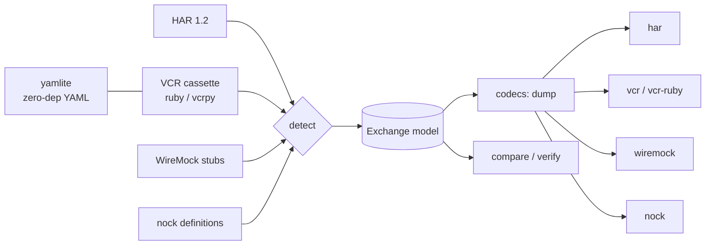

# fixmux

[English](README.md) | [中文](README.zh.md) | [日本語](README.ja.md)

[](LICENSE) [](CHANGELOG.md) [](pyproject.toml)  [](CONTRIBUTING.md)

**HAR・VCR カセット・WireMock スタブ・nock 定義の間で HTTP フィクスチャを損失なく変換する、オープンソースのゼロ依存コンバーター——一度録画すれば、どの言語スタックでも再生できる。**


```bash
git clone https://github.com/JaydenCJ/fixmux && cd fixmux && pip install -e .
```

> **プレリリース版:** fixmux はまだ PyPI に公開されていません。初回リリースまでは [JaydenCJ/fixmux](https://github.com/JaydenCJ/fixmux) をクローンし、リポジトリのルートで `pip install -e .` を実行してください。

## なぜ fixmux？

HTTP モックの各エコシステムはそれぞれ独自のフィクスチャ方言を発明し、各ツールは自分の形式しか読めません。vcrpy は vcrpy カセットだけを再生し、WireMock は WireMock スタブだけを読み込み、nock は nock 定義だけを読み込み、ブラウザが出力する HAR に至ってはどれも受け付けません。その結果、多言語チームは*同じ*ステージング API をスタックごとに 4 回録画し、誰かが 1 本を録り直した日から 4 つのコピーは乖離し始めます。fixmux はその欠けていた橋です。4 つの方言を単一の交換モデルへ解析し、任意の形式へ書き戻すので、一度キャプチャしたセッション（通常は DevTools の HAR）が Ruby・Python・JS の各テストスイートと JVM モックサーバーのフィクスチャになります。VCR の YAML を YAML 依存なしで読み、変換で何も失われていないことを証明する `verify` コマンドを備え、ターゲット形式が本当に表現できないデータには推測ではなく明示的な拒否（`--strict`）で応えます。

|  | fixmux | vcrpy | WireMock recorder | nock recorder | DevTools HAR 出力 |
|---|---|---|---|---|---|
| 読めるフィクスチャ形式 | 4 方言（5 ID） | 自家カセットのみ | 自家スタブのみ | 自家定義のみ | — |
| 書けるフィクスチャ形式 | すべて | 自家カセットのみ | 自家スタブのみ | 自家定義のみ | HAR のみ |
| エコシステム横断の共有 | できる——それが存在意義 | できない | できない | できない | できない（vcrpy/WireMock/nock は読めない） |
| フィクスチャ生成にライブ通信が必要か | 不要——既存ファイルを変換 | 必要（録画パス） | 必要（プロキシパス） | 必要（録画パス） | 必要（ブラウザセッション） |
| 無損失の証明 | `fixmux verify`、乖離で終了コード 1 | — | — | — | — |
| ランタイム依存 | 0 | 2 | JVM + jar | Node + nock | 組み込み |

<sub>依存数は 2026-07 時点で PyPI に宣言されたランタイム依存: vcrpy 8.3.0 は 2 件（PyYAML、wrapt）。fixmux の数字は [pyproject.toml](pyproject.toml) の `dependencies = []` によるもの——VCR の YAML は組み込みの `yamlite` モジュールが処理します。</sub>

## 特長

- **4 方言、1 モデル** —— HAR 1.2、VCR カセット（Ruby VCR の `http_interactions` と Python vcrpy の `interactions` の両方言）、WireMock スタブマッピング、nock 定義のすべてが単一の明示的な交換モデルを経由して変換され、どの形式ペアもサポート対象のパスです。
- **守れる所は無損失、守れない所は正直に** —— メソッド、完全な URL、順序付き多値ヘッダー、テキスト*およびバイナリ*ボディ、ステータスコードはどのホップでも生き残り、録画タイムスタンプはターゲットに対応フィールドがある限り保持されます。ターゲットが保持できないものは既定で stderr の注記になり、CI では `--strict` で確実な失敗になります。完全なサポート表は [docs/format-matrix.md](docs/format-matrix.md) にあります。
- **ランタイム依存ゼロ** —— 組み込みの `yamlite` エンジンが psych と PyYAML がカセット用に出力する YAML サブセット（折返し複数行スカラー、`!!binary`、コンパクトシーケンス）を正確に読み書きするため、サプライチェーンに PyYAML が入りません。
- **証明できる変換** —— `fixmux verify a b` は任意の 2 つのフィクスチャを意味論的に比較し（RFC 7230 のヘッダー統合、JSON を理解するボディ比較、URL 正規化）、乖離時はフィールド単位の diff とともに終了コード 1 を返します。テストスイートは変更のたびに 20 経路の往復マトリクスを実行します。
- **決定的な出力** —— 同じ入力を二度変換すればバイト単位で同一のファイルになり、キー順も各ネイティブレコーダーと揃うため、変換済みフィクスチャはレビューで綺麗に diff できます。
- **構造による検出** —— 形式は内容の形から認識し、拡張子には一切依存しません。曖昧な入力は誤読される代わりに明確なエラーで拒否されます。

## クイックスタート

インストール:

```bash
git clone https://github.com/JaydenCJ/fixmux && cd fixmux && pip install -e .
```

ブラウザのキャプチャを vcrpy カセットに変換——以下の YAML は完全かつ無編集の stdout です（stderr には破棄された HAR 固有フィールド `time`/`timings` を報告する注記も出ます）:

```bash
fixmux convert examples/capture.har -t vcr
```

```text
interactions:
- request:
    body: null
    headers:
      Accept:
      - application/json
      User-Agent:
      - demo-client/1.0
    method: GET
    uri: http://api.example.test/v1/members?page=2
  response:
    body:
      string: '{"members": [{"id": 1, "name": "aya"}], "total": 1}'
    headers:
      Content-Type:
      - application/json
      X-Request-Id:
      - req-0001
    status:
      code: 200
      message: OK
- request:
    body: '{"name": "ben"}'
    headers:
      Accept:
      - application/json
      Content-Type:
      - application/json
    method: POST
    uri: http://api.example.test/v1/members
  response:
    body:
      string: '{"id": 2, "name": "ben"}'
    headers:
      Content-Type:
      - application/json
      Location:
      - /v1/members/2
    status:
      code: 201
      message: Created
version: 1
```

`-t` を変えるだけで同じキャプチャが nock 定義（や WireMock スタブ）になり、`verify` が元ファイルとの往復で何も失われていないことを証明します:

```bash
fixmux convert examples/capture.har -t nock -o definitions.json
fixmux verify examples/capture.har definitions.json
```

```text
fixmux: note: har: ignored HAR-only fields with no exchange equivalent: time, timings
fixmux: har -> nock: wrote 2 exchanges to definitions.json
fixmux: note: har: ignored HAR-only fields with no exchange equivalent: time, timings
equivalent: 2 exchanges
```

そして `detect`/`inspect` は、触る前にフィクスチャファイルの正体を教えてくれます:

```bash
cd examples && fixmux detect capture.har cassette.yml nock-definitions.json wiremock-stubs.json
```

```text
capture.har	har	2 exchanges
cassette.yml	vcr-ruby	2 exchanges
nock-definitions.json	nock	2 exchanges
wiremock-stubs.json	wiremock	2 exchanges
```

## 対応形式

| ID | エンコーディング | 読 | 書 | 備考 |
|---|---|---|---|---|
| `har` | JSON | ✓ | ✓ | HAR 1.2。timings/cookies/cache は HAR 固有で、破棄時に注記 |
| `vcr` | YAML または JSON | ✓ | ✓ | Python vcrpy 方言。`--vcr-serializer yaml\|json` でエンコーディング選択 |
| `vcr-ruby` | YAML または JSON | ✓ | ✓ | Ruby VCR 方言。`recorded_at`（RFC 2822）と `recorded_with` を保持 |
| `wiremock` | JSON | ✓ | ✓ | 単一スタブファイルまたは `mappings` エクスポート。スタブはホストレス——読込時は `--base-url` でオリジンを補完 |
| `nock` | JSON | ✓ | ✓ | `nock.recorder` 出力 / `nock.define` 入力。`rawHeaders` と 16 進バイナリを含む |

## CLI リファレンス

| コマンド | 効果 |
|---|---|
| `fixmux convert IN -t FMT [-o OUT]` | 方言間の変換。`-f` でソース形式を強制、`-` で stdin から読込 |
| `fixmux convert … --strict` | ターゲットが表現できない場合、劣化させずに終了コード 2 で失敗 |
| `fixmux detect FILE…` | ファイルごとに検出した形式と交換数を表示 |
| `fixmux inspect FILE` | 交換ごとのサマリー（メソッド、URL、ステータス、ボディサイズ） |
| `fixmux verify A B` | 意味論的等価チェック。乖離時はフィールド diff と終了コード 1 |
| `fixmux formats` | 上記の形式テーブルを一覧表示 |

## アーキテクチャ



## ロードマップ

- [x] 4 方言コーデック一式、ゼロ依存 YAML エンジン、strict/寛容な損失処理、意味論的 verify、CLI（v0.1.0）
- [ ] PyPI への公開（`pip install fixmux`）
- [ ] Postman Collection と Playwright HAR 変種のコーデック
- [ ] `fixmux redact` パス（フィクスチャがマシンを離れる前に認証ヘッダー/トークンを除去）
- [ ] 数百 MB 級 HAR ファイル向けのストリーミングモード

全リストは [open issues](https://github.com/JaydenCJ/fixmux/issues) を参照してください。

## コントリビュート

コントリビューションを歓迎します——まずは [good first issue](https://github.com/JaydenCJ/fixmux/issues?q=is%3Aissue+is%3Aopen+label%3A%22good+first+issue%22) から始めるか、[discussion](https://github.com/JaydenCJ/fixmux/discussions) を開いてください。開発環境の構築は [CONTRIBUTING.md](CONTRIBUTING.md) を参照。`pytest` と `bash scripts/smoke.sh`（`SMOKE OK` を出力）が検証のすべてです——このリポジトリは意図的に CI を同梱していません。

## ライセンス

[MIT](LICENSE)
