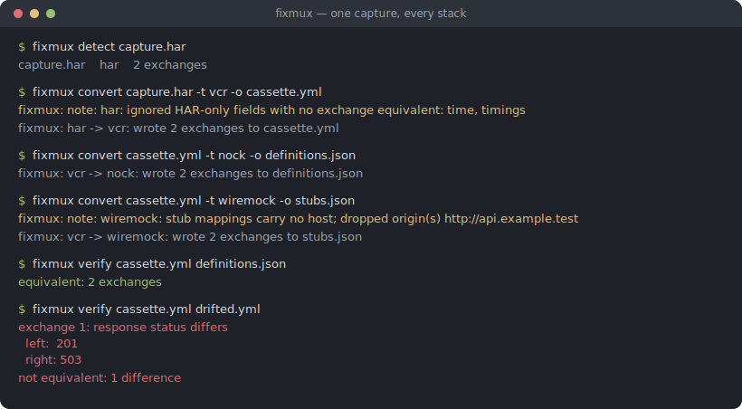
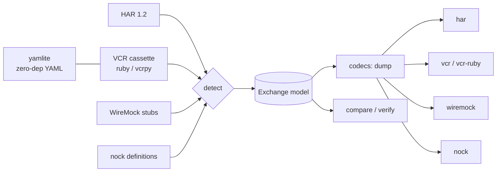

# fixmux

[English](README.md) | [中文](README.zh.md) | [日本語](README.ja.md)

[](LICENSE) [](CHANGELOG.md) [](pyproject.toml)  [](CONTRIBUTING.md)

**An open-source, zero-dependency converter that moves HTTP fixtures losslessly between HAR, VCR cassettes, WireMock stubs, and nock definitions — record an interaction once, replay it in every language stack.**



```bash
git clone https://github.com/JaydenCJ/fixmux && cd fixmux && pip install -e .
```

> **Pre-release:** fixmux is not yet published to PyPI. Until the first release, clone [JaydenCJ/fixmux](https://github.com/JaydenCJ/fixmux) and run `pip install -e .` from the repository root.

## Why fixmux?

Every HTTP-mocking ecosystem invented its own fixture dialect, and each one's tools read only their own: vcrpy replays vcrpy cassettes, WireMock loads WireMock stubs, nock loads nock definitions, and your browser exports HAR that none of them accept. So a polyglot team records the *same* staging API four times — once per stack — and the four copies drift apart the day someone re-records one of them. fixmux is the missing bridge: it parses all four dialects into one exchange model and writes any of them back out, so one captured session (usually a DevTools HAR) becomes the fixture for the Ruby suite, the Python suite, the JS suite, and the JVM mock server. It even reads VCR's YAML without a YAML dependency, ships a `verify` command that proves the conversion dropped nothing, and refuses loudly (`--strict`) instead of guessing when a target format genuinely cannot hold something.

|  | fixmux | vcrpy | WireMock recorder | nock recorder | DevTools HAR export |
|---|---|---|---|---|---|
| Fixture formats read | 4 dialects (5 IDs) | own cassettes | own stubs | own definitions | — |
| Fixture formats written | all of them | own cassettes | own stubs | own definitions | HAR only |
| Cross-ecosystem sharing | yes — that is the point | no | no | no | no (vcrpy/WireMock/nock don't read it) |
| Needs live traffic to produce a fixture | no — converts existing ones | yes (record pass) | yes (proxy pass) | yes (record pass) | yes (browser session) |
| Proves nothing was lost | `fixmux verify`, exit 1 on drift | — | — | — | — |
| Runtime dependencies | 0 | 2 | JVM + jar | Node + nock | built-in |

<sub>Dependency counts are the declared runtime requirements on PyPI as of 2026-07: vcrpy 8.3.0 lists 2 (PyYAML, wrapt). fixmux's count is `dependencies = []` in [pyproject.toml](pyproject.toml) — VCR YAML is handled by the built-in `yamlite` module.</sub>

## Features

- **Four dialects, one model** — HAR 1.2, VCR cassettes (both Ruby VCR `http_interactions` and Python vcrpy `interactions`), WireMock stub mappings, and nock definitions all convert through a single explicit exchange model; every pair of formats is a supported path.
- **Lossless where it counts, honest where it can't be** — methods, full URLs, ordered multi-valued headers, text *and binary* bodies, and status codes survive every hop; recording timestamps survive wherever the target has a field for them, and anything a target cannot hold becomes a stderr note by default and a hard `--strict` failure in CI. The full support map is in [docs/format-matrix.md](docs/format-matrix.md).
- **Zero runtime dependencies** — the built-in `yamlite` engine reads and writes exactly the YAML subset psych and PyYAML emit for cassettes (folded multi-line scalars, `!!binary`, compact sequences), so there is no PyYAML in your supply chain.
- **Conversion you can prove** — `fixmux verify a b` compares any two fixtures semantically (RFC 7230 header grouping, JSON-aware bodies, normalized URLs) and exits 1 with a field-level diff on drift; the test suite runs a 20-path round-trip matrix on every change.
- **Deterministic output** — converting the same input twice yields byte-identical files with keys sorted the way each native recorder sorts them, so converted fixtures diff cleanly in review.
- **Structural detection** — formats are recognized from content shape, never file extensions; ambiguous input is refused with a clear error instead of being misread.

## Quickstart

Install:

```bash
git clone https://github.com/JaydenCJ/fixmux && cd fixmux && pip install -e .
```

Turn a browser capture into a vcrpy cassette — the YAML below is the complete, unedited stdout (a stderr note also reports the HAR-only `time`/`timings` fields that were dropped):

```bash
fixmux convert examples/capture.har -t vcr
```

```text
interactions:
- request:
    body: null
    headers:
      Accept:
      - application/json
      User-Agent:
      - demo-client/1.0
    method: GET
    uri: http://api.example.test/v1/members?page=2
  response:
    body:
      string: '{"members": [{"id": 1, "name": "aya"}], "total": 1}'
    headers:
      Content-Type:
      - application/json
      X-Request-Id:
      - req-0001
    status:
      code: 200
      message: OK
- request:
    body: '{"name": "ben"}'
    headers:
      Accept:
      - application/json
      Content-Type:
      - application/json
    method: POST
    uri: http://api.example.test/v1/members
  response:
    body:
      string: '{"id": 2, "name": "ben"}'
    headers:
      Content-Type:
      - application/json
      Location:
      - /v1/members/2
    status:
      code: 201
      message: Created
version: 1
```

The same capture becomes nock definitions (or WireMock stubs) by changing `-t`, and `verify` proves the round trip against the original:

```bash
fixmux convert examples/capture.har -t nock -o definitions.json
fixmux verify examples/capture.har definitions.json
```

```text
fixmux: note: har: ignored HAR-only fields with no exchange equivalent: time, timings
fixmux: har -> nock: wrote 2 exchanges to definitions.json
fixmux: note: har: ignored HAR-only fields with no exchange equivalent: time, timings
equivalent: 2 exchanges
```

And `detect`/`inspect` tell you what any fixture file is before you touch it:

```bash
cd examples && fixmux detect capture.har cassette.yml nock-definitions.json wiremock-stubs.json
```

```text
capture.har	har	2 exchanges
cassette.yml	vcr-ruby	2 exchanges
nock-definitions.json	nock	2 exchanges
wiremock-stubs.json	wiremock	2 exchanges
```

## Supported formats

| ID | Encoding | Reads | Writes | Notes |
|---|---|---|---|---|
| `har` | JSON | ✓ | ✓ | HAR 1.2; timings/cookies/cache are HAR-only and noted when dropped |
| `vcr` | YAML or JSON | ✓ | ✓ | Python vcrpy dialect; `--vcr-serializer yaml\|json` picks the encoding |
| `vcr-ruby` | YAML or JSON | ✓ | ✓ | Ruby VCR dialect; keeps `recorded_at` (RFC 2822) and `recorded_with` |
| `wiremock` | JSON | ✓ | ✓ | single stub file or `mappings` export; stubs are hostless — `--base-url` restores the origin on read |
| `nock` | JSON | ✓ | ✓ | `nock.recorder` output / `nock.define` input, incl. `rawHeaders` and hex binary |

## CLI reference

| Command | Effect |
|---|---|
| `fixmux convert IN -t FMT [-o OUT]` | convert between dialects; `-f` forces the source format, stdin via `-` |
| `fixmux convert … --strict` | exit 2 instead of degrading when the target cannot represent something |
| `fixmux detect FILE…` | print detected format and exchange count per file |
| `fixmux inspect FILE` | per-exchange summary (method, URL, status, body size) |
| `fixmux verify A B` | semantic equivalence check; exit 1 with a field diff on drift |
| `fixmux formats` | list the format table above |

## Architecture



## Roadmap

- [x] Four-dialect codec set, zero-dep YAML engine, strict/lenient loss handling, semantic verify, CLI (v0.1.0)
- [ ] PyPI release with `pip install fixmux`
- [ ] Postman Collection and Playwright HAR-variant codecs
- [ ] `fixmux redact` pass (strip auth headers/tokens before fixtures leave a machine)
- [ ] Streaming mode for multi-hundred-megabyte HAR files

See the [open issues](https://github.com/JaydenCJ/fixmux/issues) for the full list.

## Contributing

Contributions are welcome — start with a [good first issue](https://github.com/JaydenCJ/fixmux/issues?q=is%3Aissue+is%3Aopen+label%3A%22good+first+issue%22) or open a [discussion](https://github.com/JaydenCJ/fixmux/discussions). See [CONTRIBUTING.md](CONTRIBUTING.md) for the development setup; `pytest` plus `bash scripts/smoke.sh` (printing `SMOKE OK`) is the whole verification story — this repository intentionally ships no CI.

## License

[MIT](LICENSE)
