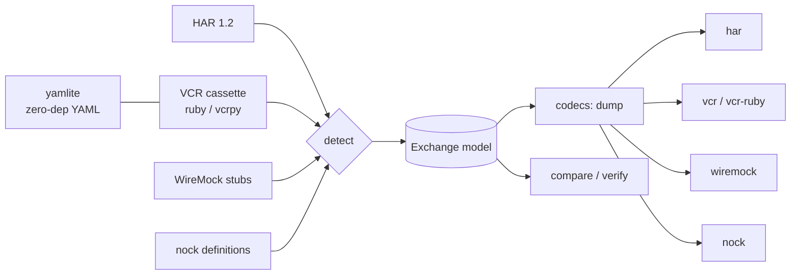

# fixmux

[English](README.md) | [中文](README.zh.md) | [日本語](README.ja.md)

[](LICENSE) [](CHANGELOG.md) [](pyproject.toml)  [](CONTRIBUTING.md)

**开源零依赖转换器：在 HAR、VCR cassette、WireMock stub 与 nock definition 之间无损搬运 HTTP fixture——录制一次交互，即可在每个语言栈中回放。**


```bash
git clone https://github.com/JaydenCJ/fixmux && cd fixmux && pip install -e .
```

> **预发布版本：** fixmux 尚未发布到 PyPI。在首个正式版本发布前，请克隆 [JaydenCJ/fixmux](https://github.com/JaydenCJ/fixmux)，并在仓库根目录运行 `pip install -e .`。

## 为什么选择 fixmux？

每个 HTTP mock 生态都发明了自己的 fixture 方言，而各自的工具只认自家格式：vcrpy 只回放 vcrpy cassette，WireMock 只加载 WireMock stub，nock 只加载 nock definition，浏览器导出的 HAR 更是没有一个能直接用。于是多语言团队要把*同一个*预发 API 录制四遍——每个技术栈一遍——而只要有人重录其中一份，四份副本从那天起就开始漂移。fixmux 就是缺失的那座桥：它把四种方言解析进同一个交换模型，再写出任意一种，让一次捕获的会话（通常是 DevTools 的 HAR）同时成为 Ruby 套件、Python 套件、JS 套件和 JVM mock 服务器的 fixture。它读取 VCR 的 YAML 甚至不需要 YAML 依赖，自带 `verify` 命令证明转换没有丢失任何东西，并在目标格式确实装不下某些数据时大声拒绝（`--strict`）而不是瞎猜。

|  | fixmux | vcrpy | WireMock recorder | nock recorder | DevTools HAR 导出 |
|---|---|---|---|---|---|
| 可读取的 fixture 格式 | 4 种方言（5 个 ID） | 仅自家 cassette | 仅自家 stub | 仅自家 definition | — |
| 可写出的 fixture 格式 | 全部 | 仅自家 cassette | 仅自家 stub | 仅自家 definition | 仅 HAR |
| 跨生态共享 | 可以——这正是它的意义 | 不行 | 不行 | 不行 | 不行（vcrpy/WireMock/nock 都不读它） |
| 产出 fixture 是否需要真实流量 | 不需要——直接转换现有文件 | 需要（录制一遍） | 需要（代理一遍） | 需要（录制一遍） | 需要（浏览器会话） |
| 能否证明无损 | `fixmux verify`，漂移时退出码 1 | — | — | — | — |
| 运行时依赖 | 0 | 2 | JVM + jar | Node + nock | 内置 |

<sub>依赖数为 2026-07 时 PyPI 上声明的运行时依赖：vcrpy 8.3.0 列出 2 个（PyYAML、wrapt）。fixmux 的数字来自 [pyproject.toml](pyproject.toml) 中的 `dependencies = []`——VCR 的 YAML 由内置 `yamlite` 模块处理。</sub>

## 特性

- **四种方言，一个模型** —— HAR 1.2、VCR cassette（Ruby VCR 的 `http_interactions` 与 Python vcrpy 的 `interactions` 两种方言）、WireMock stub mapping、nock definition 全部经由同一个显式交换模型转换；任意两种格式之间都是受支持的路径。
- **该无损的地方无损，装不下的地方诚实** —— 方法、完整 URL、有序多值 header、文本*与二进制*正文、状态码在每一跳中都能存活；录制时间戳只要目标格式有对应字段就会保留，目标装不下的内容默认变成 stderr 提示，CI 中可用 `--strict` 变成硬性失败。完整支持矩阵见 [docs/format-matrix.md](docs/format-matrix.md)。
- **零运行时依赖** —— 内置 `yamlite` 引擎精确读写 psych 与 PyYAML 为 cassette 输出的 YAML 子集（折叠多行标量、`!!binary`、紧凑序列），供应链里没有 PyYAML。
- **可证明的转换** —— `fixmux verify a b` 对任意两个 fixture 做语义比较（RFC 7230 header 归组、JSON 感知的正文、URL 规范化），漂移时以字段级 diff 退出码 1；测试套件在每次改动上跑 20 条往返矩阵。
- **确定性输出** —— 同一输入转换两次得到逐字节相同的文件，键序与各原生录制器一致，转换出的 fixture 在 review 中能干净地 diff。
- **结构化检测** —— 格式由内容形状识别，从不依赖文件扩展名；含糊的输入会被明确报错拒绝，而不是被误读。

## 快速上手

安装：

```bash
git clone https://github.com/JaydenCJ/fixmux && cd fixmux && pip install -e .
```

把浏览器捕获转换为 vcrpy cassette——下面的 YAML 是完整、未经删改的 stdout（stderr 还会有一条提示，报告被丢弃的 HAR 独有字段 `time`/`timings`）：

```bash
fixmux convert examples/capture.har -t vcr
```

```text
interactions:
- request:
    body: null
    headers:
      Accept:
      - application/json
      User-Agent:
      - demo-client/1.0
    method: GET
    uri: http://api.example.test/v1/members?page=2
  response:
    body:
      string: '{"members": [{"id": 1, "name": "aya"}], "total": 1}'
    headers:
      Content-Type:
      - application/json
      X-Request-Id:
      - req-0001
    status:
      code: 200
      message: OK
- request:
    body: '{"name": "ben"}'
    headers:
      Accept:
      - application/json
      Content-Type:
      - application/json
    method: POST
    uri: http://api.example.test/v1/members
  response:
    body:
      string: '{"id": 2, "name": "ben"}'
    headers:
      Content-Type:
      - application/json
      Location:
      - /v1/members/2
    status:
      code: 201
      message: Created
version: 1
```

只需改 `-t`，同一份捕获就能变成 nock definition（或 WireMock stub），再用 `verify` 对照原件证明这趟往返没有丢失：

```bash
fixmux convert examples/capture.har -t nock -o definitions.json
fixmux verify examples/capture.har definitions.json
```

```text
fixmux: note: har: ignored HAR-only fields with no exchange equivalent: time, timings
fixmux: har -> nock: wrote 2 exchanges to definitions.json
fixmux: note: har: ignored HAR-only fields with no exchange equivalent: time, timings
equivalent: 2 exchanges
```

在动手之前，`detect`/`inspect` 能告诉你任意 fixture 文件是什么：

```bash
cd examples && fixmux detect capture.har cassette.yml nock-definitions.json wiremock-stubs.json
```

```text
capture.har	har	2 exchanges
cassette.yml	vcr-ruby	2 exchanges
nock-definitions.json	nock	2 exchanges
wiremock-stubs.json	wiremock	2 exchanges
```

## 支持的格式

| ID | 编码 | 读 | 写 | 备注 |
|---|---|---|---|---|
| `har` | JSON | ✓ | ✓ | HAR 1.2；timings/cookies/cache 为 HAR 独有，丢弃时会提示 |
| `vcr` | YAML 或 JSON | ✓ | ✓ | Python vcrpy 方言；`--vcr-serializer yaml\|json` 选择编码 |
| `vcr-ruby` | YAML 或 JSON | ✓ | ✓ | Ruby VCR 方言；保留 `recorded_at`（RFC 2822）与 `recorded_with` |
| `wiremock` | JSON | ✓ | ✓ | 单个 stub 文件或 `mappings` 导出；stub 不含主机——读取时用 `--base-url` 补回来源 |
| `nock` | JSON | ✓ | ✓ | `nock.recorder` 输出 / `nock.define` 输入，含 `rawHeaders` 与十六进制二进制 |

## CLI 参考

| 命令 | 效果 |
|---|---|
| `fixmux convert IN -t FMT [-o OUT]` | 在方言之间转换；`-f` 强制指定来源格式，`-` 读取 stdin |
| `fixmux convert … --strict` | 目标装不下某些内容时以退出码 2 失败，而非降级 |
| `fixmux detect FILE…` | 逐文件打印检测到的格式与交换数量 |
| `fixmux inspect FILE` | 逐交换摘要（方法、URL、状态码、正文大小） |
| `fixmux verify A B` | 语义等价检查；漂移时输出字段 diff 并退出码 1 |
| `fixmux formats` | 列出上面的格式表 |

## 架构



## 路线图

- [x] 四方言编解码器、零依赖 YAML 引擎、strict/宽松丢失处理、语义 verify、CLI（v0.1.0）
- [ ] 发布到 PyPI，支持 `pip install fixmux`
- [ ] Postman Collection 与 Playwright HAR 变体编解码器
- [ ] `fixmux redact` 处理（fixture 离开机器前剥除认证 header/token）
- [ ] 针对数百 MB HAR 文件的流式模式

完整列表见 [open issues](https://github.com/JaydenCJ/fixmux/issues)。

## 贡献

欢迎贡献——从一个 [good first issue](https://github.com/JaydenCJ/fixmux/issues?q=is%3Aissue+is%3Aopen+label%3A%22good+first+issue%22) 开始，或发起一个 [discussion](https://github.com/JaydenCJ/fixmux/discussions)。开发环境搭建见 [CONTRIBUTING.md](CONTRIBUTING.md)；`pytest` 加 `bash scripts/smoke.sh`（打印 `SMOKE OK`）就是全部验证流程——本仓库有意不携带 CI。

## 许可证

[MIT](LICENSE)
